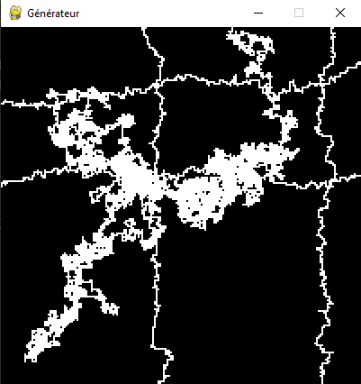

# Basic Pygame Path Generator
Ce projet à pour but d'utiliser la bibliothèque [pygame](https://www.pygame.org/wiki/about) pour expérimenter un
algorithme de création de chemin.

## Screenshot

## Fonctionnalités
- Génération pseudo alétoire d'un chemin
- Touche espace pour une nouvelle génération